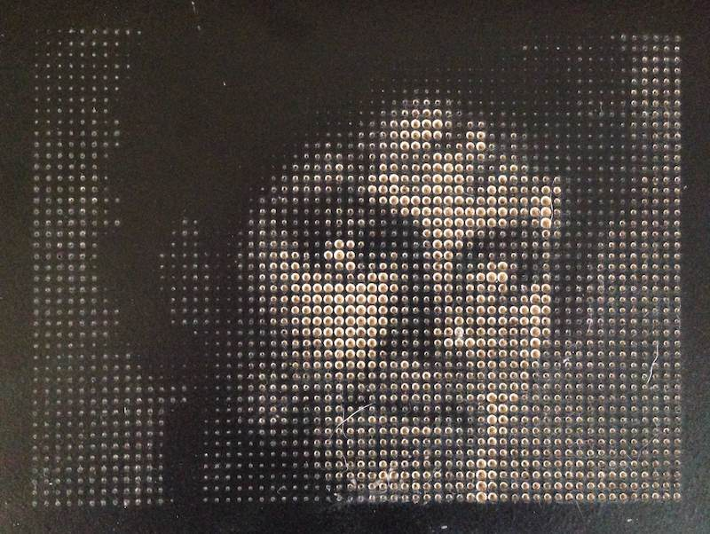

# ImagePoints #

This app generates G-code that can be used with a CNC router to cut a grid of dots whose depths depend on the brightness of the corresponding points in a given image.
The basic idea is that you could use a v-cutter bit to cut holes in a black melamine board to expose light particle board dots whose size represent "pixels" of a given brightness.
Scene from a distance, the holes of varying "brightness" appear as pixels to show the image.

