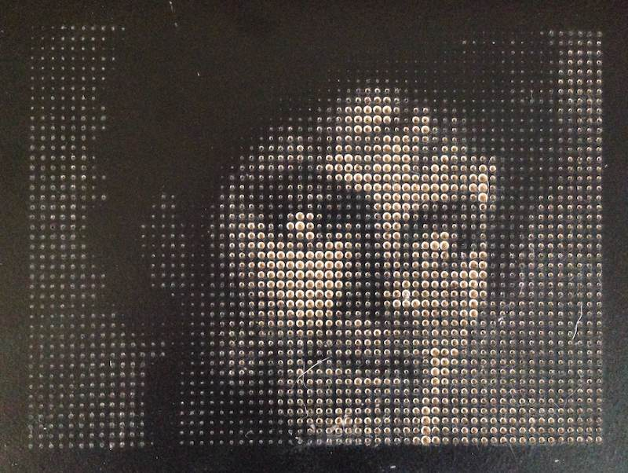

# ImagePoints #

This app generates G-code that can be used with a CNC router to cut a field of points whose depths depend on the brightness of the corresponding points in a given image.
The basic idea is that you could use a v-cutter bit to cut holes in a black melamine board to expose light particle board dots whose size represent "pixels" of a given brightness.
Seen from a distance, the holes of varying "brightness" appear as pixels to show the image.

### Installation ###

To get around cross-domain scripting security considerations, this generally requires a proxy to be used to load the image.
By default, ImagePoints looks in the current directory for the PHP proxy `ba-simple-proxy.php`.
This way, any image in the browser can be quickly imported by copying the image URL into the ImagePoints text field.

### Usage ###

* Use something like `http://www.online-image-editor.com/` to quickly crop and adjust images for use with ImagePoints. Then load `index.html` and copy your image URL into the URL field of ImagePoints.

* Slide the `blocksize` slider to control the distance between the dots. Slide the `holesize` to control the cut depth (hole size) and see the hole pattern change each time an adjustment is made.

* To see your hole pattern without the original image, click the checkbox to turn the image display off.

* When happy with the hole pattern, scroll down and input the final width of the image in inches. The height will be calculated automatically according to the aspect ration of the image.

* Click `produce g-code` to generate the g-code for the cut, which will appear in the textarea below.

* Copy the g-code into your CNC system and make sure to examine the cut pattern for unwanted or dangerous patterns - please don't blame me if something goes wrong.
